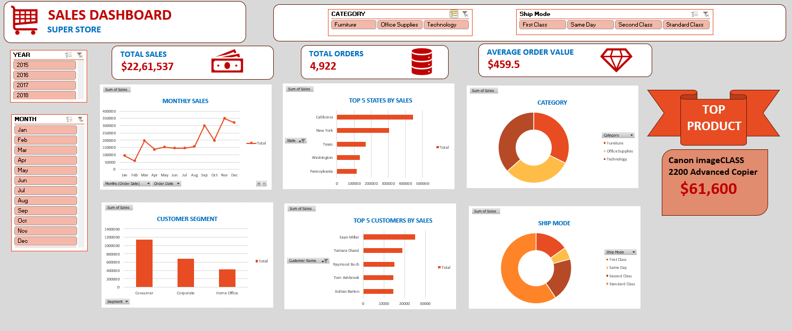

# Sales Dashboard (Excel)

## 📌 Overview
This project is an Excel-based dashboard designed to analyze sales performance, sales trends, and regional sales distribution.

## 🎯 Key Features
- KPI metrics for sales analysis
- Regional sales performance tracking
- Monthly sales trend analysis
- Interactive charts and slicers

## 🛠  Tools Used
- Microsoft Excel
- Pivot Tables
- Charts
- Slicers

## 📈 Insights
- November recorded the highest overall sales compared to other months, indicating strong end-of-year sales performance.
- Canon imageCLASS 2200 Advanced Copier was the top-performing product with sales worth approximately $61,600.
- Customers showed the highest preference for Standard Class shipping mode over other shipping options.
- The Technology category generated the highest sales contribution among all product categories.
- Consumer segment contributed more sales compared to Corporate and Home Office customer segments.

## 📷 Dashboard Preview

## 🚀 About Me

Aspiring Data Analyst with experience in MIS reporting and strong interest in data analysis and visualization.
